Predicting NBME Percentiles
================
Trish Campos
2017-06-16

Background
==========

First year students take two semesters of both Medical Physiology and Translational Physiology before sitting for the physiology board exam in the spring. Predictor variables include exam grades for each block for both fall and spring semesters. Students were only excluded from the data set if they did not sit for the national board exam on the May administration. All scores were downloaded from Blackboard.

The students are required to sit for the [National Board of Medical Examiners Physiology](http://www.nbme.org/students/Subject-Exams/subexams.html) subject test in the spring. The scores consist of the raw number correct for both the physiology and neurophysiology sections of the exam. There is also a combined raw score that accounts for both sections. An “NBME score” is then obtained from the combined raw score. This NBME score is then converted into a percentile. The percentiles are based on the performance of 4,565 students from 26 different institutions. Although the score on the exam does not factor into the final grades, students are required to pass in order to graduate. Passing is set by the department at the third percentile.

The purpose of this study is to predict performance (measured by percentile) on the NBME exam based on final semester grades for both classes and practice test scores.

Research Questions
==================

1.  Predict NBME percentile based on Block exam scores.

The Data
========

Data Load
---------

``` r
# Grades Entering 2011 Class Medical Physiology 
class2011_481 <- read_excel("Grades_Raw_2.xlsx", sheet = "2011_481")
class2011_483 <- read_excel("Grades_Raw_2.xlsx", sheet = "2011_483")
class2011_482 <- read_excel("Grades_Raw_2.xlsx", sheet = "2011_482")
class2011_484 <- read_excel("Grades_Raw_2.xlsx", sheet = "2011_484")
list2011 <- c(class2011_483, class2011_484)

# Grades Entering 2012 Class Medical Physiology
class2012_481 <- read_excel("Grades_Raw_2.xlsx", sheet = "2012_481")
class2012_483 <- read_excel("Grades_Raw_2.xlsx", sheet = "2012_483")
class2012_482 <- read_excel("Grades_Raw_2.xlsx", sheet = "2012_482")
class2012_484 <- read_excel("Grades_Raw_2.xlsx", sheet = "2012_484")
class2012_NBME <- read_excel("Grades_Raw_2.xlsx", sheet = "2012_NBME")

# Grades Entering 2013 Class Medical Physiology
class2013_481 <- read_excel("Grades_Raw_2.xlsx", sheet = "2013_481")
class2013_483 <- read_excel("Grades_Raw_2.xlsx", sheet = "2013_483")
class2013_482 <- read_excel("Grades_Raw_2.xlsx", sheet = "2013_482")
class2013_484 <- read_excel("Grades_Raw_2.xlsx", sheet = "2013_484")
class2013_NBME <- read_excel("Grades_Raw_2.xlsx", sheet = "2013_NBME")

# Grades Entering 2014 Class Medical Physiology
class2014_NBME <- read_excel("Grades_Raw_2.xlsx", sheet = "2014_NBME")
class2014_Hob <- read_excel("Grades_Raw_2.xlsx", sheet = "2014_Hob")

# Grades Entering 2015 Class Medical Physiology
class2015_481 <- read_excel("Grades_Raw_2.xlsx", sheet = "2015_481")
class2015_483 <- read_excel("Grades_Raw_2.xlsx", sheet = "2015_483")
class2015_482 <- read_excel("Grades_Raw_2.xlsx", sheet = "2015_482")
class2015_484 <- read_excel("Grades_Raw_2.xlsx", sheet = "2015_484")
class2015_NBME <- read_excel("Grades_Raw_2.xlsx", sheet = "2015_NBME")
class2015_Hob <- read_excel("Grades_Raw_2.xlsx", sheet = "2015_Hob")

# Grades Entering 2016 Class Medical Physiology
class2016_481 <- read_excel("Grades_Raw_2.xlsx", sheet = "2016_481")
class2016_483 <- read_excel("Grades_Raw_2.xlsx", sheet = "2016_483")
class2016_482 <- read_excel("Grades_Raw_2.xlsx", sheet = "2016_482")
class2016_484 <- read_excel("Grades_Raw_2.xlsx", sheet = "2016_484")
class2016_NBME <- read_excel("Grades_Raw_2.xlsx", sheet = "2016_NBME")
class2016_Hob <- read_excel("Grades_Raw_2.xlsx", sheet = "2016_Hob")
```

The data were pooled from the google grade sheet for each class. Hobson data was also included.

Tidying
-------

``` r
class2011 <- class2011_481 %>% 
  full_join(class2011_482, by = c("Last.name", "First.name")) %>% 
  full_join(class2011_483, by = c("Last.name", "First.name")) %>%
  full_join(class2011_484, by = c("Last.name", "First.name")) %>%
  mutate(Year = 2011) # Keep track of Entry Year

class2012 <- class2012_481 %>% 
  full_join(class2012_482, by = c("Last.name", "First.name")) %>% 
  full_join(class2012_483, by = c("Last.name", "First.name")) %>%
  full_join(class2012_484, by = c("Last.name", "First.name")) %>%
  full_join(class2012_NBME, by = c("Last.name", "First.name")) %>%
  mutate(Year = 2012) # Keep track of Entry year

class2013 <- class2013_481 %>% 
  full_join(class2013_482, by = c("Last.name", "First.name")) %>% 
  full_join(class2013_483, by = c("Last.name", "First.name")) %>%
  full_join(class2013_484, by = c("Last.name", "First.name")) %>%
  full_join(class2013_NBME, by = c("Last.name", "First.name")) %>%
  mutate(Year = 2013) # Keep track of Entry year

class2014 <- class2014_Hob %>% 
  full_join(class2014_NBME, by = c("Last.name", "First.name")) %>% 
  mutate(Year = 2014) # Keep track of Entry year

class2015 <- class2015_481 %>% 
  full_join(class2015_482, by = c("Last.name", "First.name")) %>% 
  full_join(class2015_483, by = c("Last.name", "First.name")) %>%
  full_join(class2015_484, by = c("Last.name", "First.name")) %>%
  full_join(class2015_NBME, by = c("Last.name", "First.name")) %>%
  full_join(class2015_Hob, by = c("Last.name", "First.name")) %>%
  mutate(Year = 2015) # Keep track of Entry year

class2016 <- class2016_481 %>% 
  full_join(class2016_482, by = c("Last.name", "First.name")) %>% 
  full_join(class2016_483, by = c("Last.name", "First.name")) %>% 
  full_join(class2016_484, by = c("Last.name", "First.name")) %>% 
  full_join(class2016_NBME, by = c("Last.name", "First.name")) %>% 
  full_join(class2016_Hob, by = c("Last.name", "First.name")) %>% 
  mutate(Year = 2016) # Keep track of Entry year

demographics <- bind_rows(class2011, class2012, class2013, 
                          class2014, class2015, class2016)

dems <- demographics %>% 
  mutate(id = 1:nrow(demographics),
         NBME.sqrt = NBME.Percentile^0.5,
         Pass = ifelse(NBME.Percentile >= 3, 1, 0),
         Pass.f = factor(Pass, levels = c(1,0), labels = c("Pass", "Fail"))) %>% 
  filter(Year != 2011) %>% 
  select(id, Last.name, First.name, Year, Phys.B1.E1, 
         Phys.B2.E2, Phys.B3.E3, Phys.B4.E4, Phys.B5.E5, Phys.B6.E6, Phys.B7.E7, 
         Phys.B8.E8, Trans.B1.E1, Trans.B2.E2, Trans.B3.E3, Trans.B4.E4, 
         Trans.B5.E5, Trans.B6.E6, Trans.B7.E7, Trans.B8.E8, NBME.Percentile, 
         NBME.Prac.1, NBME.Prac.2, NBME.Prac.Neuro, Pass, Pass.f, NBME.sqrt)
```

The grades from each semester (481, 482, 483, and 484) were joined using the `full_join` command to create a separate tibble for each class. Because student ID's were not included, the first and last names were used to link the grades for each student. These tibbles were then merged together to include all of the years in the final tidy dataset. The data from 2011 will not be included in this study as the Translational class differed from that of the later years.

``` r
# Select the variables for a complete case analysis
dems.complete <- dems %>%
  select(id, Last.name, First.name, Year, Phys.B1.E1, 
         Phys.B2.E2, Phys.B3.E3, Phys.B4.E4, Phys.B5.E5, Phys.B6.E6, Phys.B7.E7, 
         Phys.B8.E8, Trans.B1.E1, Trans.B2.E2, Trans.B3.E3, Trans.B4.E4, 
         Trans.B5.E5, Trans.B6.E6, Trans.B7.E7, Trans.B8.E8, NBME.Percentile, 
         Pass, Pass.f, NBME.sqrt) %>% 
  na.omit()
```

``` r
# Remove cases without outcomes
dems.predict <- dems %>%
  filter(!is.na(NBME.Percentile))

# Impute
dems.imp <- as.data.frame(mice::complete(mice(dems.predict, 
                                m = 1, maxit = 10, seed = 271828, print = F),1))
```

There were two tibbles used in this project:

-   The complete case with 395 rows and 24 columns (variables)

``` r
glimpse(dems.complete)
```

    Observations: 395
    Variables: 24
    $ id              <int> 47, 49, 50, 52, 53, 54, 55, 56, 57, 58, 60, 61...
    $ Last.name       <chr> "Abrah", "Ajoku", "Akeson", "Armocida", "Azem"...
    $ First.name      <chr> "Akua", "Ugochinyere", "Graham", "Stephanie", ...
    $ Year            <dbl> 2012, 2012, 2012, 2012, 2012, 2012, 2012, 2012...
    $ Phys.B1.E1      <dbl> 85, 80, 99, 89, 84, 85, 85, 73, 74, 95, 93, 86...
    $ Phys.B2.E2      <dbl> 92, 81, 83, 96, 88, 87, 82, 83, 77, 87, 79, 91...
    $ Phys.B3.E3      <dbl> 85, 78, 88, 93, 81, 71, 81, 80, 77, 91, 78, 83...
    $ Phys.B4.E4      <dbl> 97, 86, 87, 91, 86, 89, 81, 89, 77, 96, 86, 87...
    $ Phys.B5.E5      <dbl> 87, 80, 89, 96, 74, 81, 82, 79, 79, 79, 91, 76...
    $ Phys.B6.E6      <dbl> 97, 77, 80, 87, 65, 88, 78, 88, 68, 95, 84, 73...
    $ Phys.B7.E7      <dbl> 95, 94, 81, 98, 87, 82, 82, 75, 78, 88, 79, 82...
    $ Phys.B8.E8      <dbl> 94, 80, 80, 84, 82, 90, 90, 86, 72, 84, 80, 88...
    $ Trans.B1.E1     <dbl> 85.19500, 76.17000, 86.41750, 95.10750, 85.070...
    $ Trans.B2.E2     <dbl> 98.2250, 98.8500, 84.6875, 89.8500, 83.4250, 8...
    $ Trans.B3.E3     <dbl> 83.600, 80.375, 89.800, 91.500, 86.475, 82.000...
    $ Trans.B4.E4     <dbl> 95.575, 79.200, 87.950, 83.650, 89.700, 84.725...
    $ Trans.B5.E5     <dbl> 82.175, 80.125, 95.250, 95.450, 81.600, 83.425...
    $ Trans.B6.E6     <dbl> 87.750, 90.225, 86.800, 82.375, 82.000, 87.500...
    $ Trans.B7.E7     <dbl> 88.000, 81.625, 71.500, 89.875, 79.875, 91.250...
    $ Trans.B8.E8     <dbl> 93.750, 86.250, 85.700, 90.000, 90.000, 91.875...
    $ NBME.Percentile <dbl> 87, 11, 53, 73, 5, 9, 39, 22, 56, 76, 7, 7, 3,...
    $ Pass            <dbl> 1, 1, 1, 1, 1, 1, 1, 1, 1, 1, 1, 1, 1, 1, 1, 0...
    $ Pass.f          <fctr> Pass, Pass, Pass, Pass, Pass, Pass, Pass, Pas...
    $ NBME.sqrt       <dbl> 9.327379, 3.316625, 7.280110, 8.544004, 2.2360...

-   The imputed case with 538 rows and 27 columns (variables)

``` r
glimpse(dems.predict)
```

    Observations: 538
    Variables: 27
    $ id              <int> 47, 49, 50, 51, 52, 53, 54, 55, 56, 57, 58, 59...
    $ Last.name       <chr> "Abrah", "Ajoku", "Akeson", "Almotah", "Armoci...
    $ First.name      <chr> "Akua", "Ugochinyere", "Graham", "Khalil", "St...
    $ Year            <dbl> 2012, 2012, 2012, 2012, 2012, 2012, 2012, 2012...
    $ Phys.B1.E1      <dbl> 85, 80, 99, 74, 89, 84, 85, 85, 73, 74, 95, 73...
    $ Phys.B2.E2      <dbl> 92, 81, 83, 77, 96, 88, 87, 82, 83, 77, 87, 80...
    $ Phys.B3.E3      <dbl> 85, 78, 88, 66, 93, 81, 71, 81, 80, 77, 91, 61...
    $ Phys.B4.E4      <dbl> 97, 86, 87, NA, 91, 86, 89, 81, 89, 77, 96, 71...
    $ Phys.B5.E5      <dbl> 87, 80, 89, 84, 96, 74, 81, 82, 79, 79, 79, 55...
    $ Phys.B6.E6      <dbl> 97, 77, 80, 86, 87, 65, 88, 78, 88, 68, 95, 53...
    $ Phys.B7.E7      <dbl> 95, 94, 81, 89, 98, 87, 82, 82, 75, 78, 88, 55...
    $ Phys.B8.E8      <dbl> 94, 80, 80, 74, 84, 82, 90, 90, 86, 72, 84, NA...
    $ Trans.B1.E1     <dbl> 85.19500, 76.17000, 86.41750, 77.29500, 95.107...
    $ Trans.B2.E2     <dbl> 98.2250, 98.8500, 84.6875, 80.7000, 89.8500, 8...
    $ Trans.B3.E3     <dbl> 83.600, 80.375, 89.800, 84.625, 91.500, 86.475...
    $ Trans.B4.E4     <dbl> 95.575, 79.200, 87.950, 71.450, 83.650, 89.700...
    $ Trans.B5.E5     <dbl> 82.175, 80.125, 95.250, 59.500, 95.450, 81.600...
    $ Trans.B6.E6     <dbl> 87.750, 90.225, 86.800, 61.500, 82.375, 82.000...
    $ Trans.B7.E7     <dbl> 88.000, 81.625, 71.500, 69.125, 89.875, 79.875...
    $ Trans.B8.E8     <dbl> 93.750, 86.250, 85.700, 84.400, 90.000, 90.000...
    $ NBME.Percentile <dbl> 87, 11, 53, 4, 73, 5, 9, 39, 22, 56, 76, 6, 7,...
    $ NBME.Prac.1     <dbl> NA, NA, NA, NA, NA, NA, NA, NA, NA, NA, NA, NA...
    $ NBME.Prac.2     <dbl> NA, NA, NA, NA, NA, NA, NA, NA, NA, NA, NA, NA...
    $ NBME.Prac.Neuro <dbl> NA, NA, NA, NA, NA, NA, NA, NA, NA, NA, NA, NA...
    $ Pass            <dbl> 1, 1, 1, 1, 1, 1, 1, 1, 1, 1, 1, 1, 1, 1, 1, 1...
    $ Pass.f          <fctr> Pass, Pass, Pass, Pass, Pass, Pass, Pass, Pas...
    $ NBME.sqrt       <dbl> 9.327379, 3.316625, 7.280110, 2.000000, 8.5440...

Code Book
---------

``` r
codebook <- data_frame(
    Variable = c("id", "Year", "Phys.B1.E1", 
                 "Phys.B2.E2", "Phys.B3.E3", "Phys.B4.E4", "Phys.B5.E5", 
                 "Phys.B6.E6", "Phys.B7.E7", "Phys.B8.E8", "Trans.B1.E1", 
                 "Trans.B2.E2", "Trans.B3.E3", "Trans.B4.E4", "Trans.B5.E5", 
                 "Trans.B6.E6", "Trans.B7.E7", "Trans.B8.E8", "NBME.Percentile"),
    Type = c("Record Id", "Categorical", "Quant", 
                 "Quant", "Quant", "Quant", "Quant", 
                 "Quant", "Quant", "Quant", "Quant", 
                 "Quant", "Quant", "Quant", "Quant", 
                 "Quant", "Quant", "Quant", "Quant Outcome"),
    Notes = c("Linking Number for each student", "Year of program entry (2011 - 2016)",
              "Med Phys Block 1 Exam (47 - 103)", "Med Phys Block 2 Exam (52 - 103)",
              "Med Phys Block 3 Exam (17 - 119)", "Med Phys Block 4 Exam (44 - 100)",
              "Med Phys Block 5 Exam (55 - 104)", "Med Phys Block 6 Exam (53 - 114)", 
              "Med Phys Block 7 Exam (49 - 105)", "Med Phys Block 8 Exam (69 - 100)", 
              "Trans Phys Block 1 Exam (45 - 117)", "Trans Phys Block 2 Exam (42 - 112)",
              "Trans Phys Block 3 Exam (12 - 115)", "Trans Phys Block 4 Exam (6 - 107)",
              "Trans Phys Block 5 Exam (39 - 102)", "Trans Phys Block 6 Exam (33 - 106)",
              "Trans Phys Block 7 Exam (36 - 101)", "Trans Phys Block 8 Exam (56 - 105)",
              "NBME Percentile (0 - 99)")
    )

#pander(codebook, split.cells = c(10, 10, 53), caption = "Codebook")
codebook
```

    # A tibble: 19 x 3
              Variable          Type                               Notes
                 <chr>         <chr>                               <chr>
     1              id     Record Id     Linking Number for each student
     2            Year   Categorical Year of program entry (2011 - 2016)
     3      Phys.B1.E1         Quant    Med Phys Block 1 Exam (47 - 103)
     4      Phys.B2.E2         Quant    Med Phys Block 2 Exam (52 - 103)
     5      Phys.B3.E3         Quant    Med Phys Block 3 Exam (17 - 119)
     6      Phys.B4.E4         Quant    Med Phys Block 4 Exam (44 - 100)
     7      Phys.B5.E5         Quant    Med Phys Block 5 Exam (55 - 104)
     8      Phys.B6.E6         Quant    Med Phys Block 6 Exam (53 - 114)
     9      Phys.B7.E7         Quant    Med Phys Block 7 Exam (49 - 105)
    10      Phys.B8.E8         Quant    Med Phys Block 8 Exam (69 - 100)
    11     Trans.B1.E1         Quant  Trans Phys Block 1 Exam (45 - 117)
    12     Trans.B2.E2         Quant  Trans Phys Block 2 Exam (42 - 112)
    13     Trans.B3.E3         Quant  Trans Phys Block 3 Exam (12 - 115)
    14     Trans.B4.E4         Quant   Trans Phys Block 4 Exam (6 - 107)
    15     Trans.B5.E5         Quant  Trans Phys Block 5 Exam (39 - 102)
    16     Trans.B6.E6         Quant  Trans Phys Block 6 Exam (33 - 106)
    17     Trans.B7.E7         Quant  Trans Phys Block 7 Exam (36 - 101)
    18     Trans.B8.E8         Quant  Trans Phys Block 8 Exam (56 - 105)
    19 NBME.Percentile Quant Outcome            NBME Percentile (0 - 99)

Table 1
-------

``` r
# Make a Table 1 for the Complete Cases
vars <- c("Phys.B1.E1", "Phys.B2.E2", "Phys.B3.E3",
          "Phys.B4.E4", "Phys.B5.E5", "Phys.B6.E6", 
          "Phys.B7.E7", "Phys.B8.E8", 
          "Trans.B1.E1", "Trans.B2.E2", 
          "Trans.B3.E3", "Trans.B4.E4", "Trans.B5.E5", 
          "Trans.B6.E6", "Trans.B7.E7", "Trans.B8.E8", 
          "NBME.Percentile")

CreateTableOne(vars = vars,
               strata = "Year", data = dems.complete)
```

                                 Stratified by Year
                                  2012          2013          2015         
      n                              78            71           107        
      Phys.B1.E1 (mean (sd))      85.41 (9.21)  88.99 (8.47)  85.06 (7.76) 
      Phys.B2.E2 (mean (sd))      85.46 (8.67)  85.83 (9.24)  83.46 (8.62) 
      Phys.B3.E3 (mean (sd))      86.17 (9.78)  88.15 (10.46) 85.37 (9.25) 
      Phys.B4.E4 (mean (sd))      87.31 (6.16)  85.51 (7.95)  83.25 (7.67) 
      Phys.B5.E5 (mean (sd))      85.12 (6.93)  84.82 (8.23)  82.11 (7.57) 
      Phys.B6.E6 (mean (sd))      85.08 (9.21)  86.17 (9.25)  85.31 (10.60)
      Phys.B7.E7 (mean (sd))      86.17 (7.52)  84.85 (7.78)  84.93 (8.54) 
      Phys.B8.E8 (mean (sd))      86.21 (6.92)  85.87 (5.85)  90.52 (5.65) 
      Trans.B1.E1 (mean (sd))     82.96 (9.43)  86.92 (13.62) 85.50 (12.24)
      Trans.B2.E2 (mean (sd))     85.55 (9.11)  86.46 (10.26) 83.67 (12.40)
      Trans.B3.E3 (mean (sd))     84.84 (9.71)  83.62 (14.12) 83.36 (12.09)
      Trans.B4.E4 (mean (sd))     84.82 (5.35)  83.48 (11.66) 84.77 (9.98) 
      Trans.B5.E5 (mean (sd))     84.39 (8.21)  83.44 (11.38) 85.22 (8.19) 
      Trans.B6.E6 (mean (sd))     85.05 (7.68)  84.27 (10.22) 84.40 (9.59) 
      Trans.B7.E7 (mean (sd))     84.47 (6.94)  85.39 (9.49)  84.07 (8.05) 
      Trans.B8.E8 (mean (sd))     89.10 (5.35)  86.86 (7.43)  85.64 (7.71) 
      NBME.Percentile (mean (sd)) 39.83 (30.49) 44.39 (28.66) 32.54 (27.89)
                                 Stratified by Year
                                  2016          p      test
      n                             139                    
      Phys.B1.E1 (mean (sd))      83.95 (8.93)   0.001     
      Phys.B2.E2 (mean (sd))      86.61 (8.66)   0.045     
      Phys.B3.E3 (mean (sd))      87.04 (11.14)  0.317     
      Phys.B4.E4 (mean (sd))      83.60 (7.87)   0.001     
      Phys.B5.E5 (mean (sd))      83.53 (8.06)   0.036     
      Phys.B6.E6 (mean (sd))      84.76 (10.95)  0.821     
      Phys.B7.E7 (mean (sd))      83.83 (8.23)   0.240     
      Phys.B8.E8 (mean (sd))      89.40 (5.56)  <0.001     
      Trans.B1.E1 (mean (sd))     83.96 (12.79)  0.182     
      Trans.B2.E2 (mean (sd))     82.94 (13.40)  0.148     
      Trans.B3.E3 (mean (sd))     84.06 (12.09)  0.862     
      Trans.B4.E4 (mean (sd))     85.92 (11.40)  0.420     
      Trans.B5.E5 (mean (sd))     84.06 (8.25)   0.585     
      Trans.B6.E6 (mean (sd))     84.84 (10.63)  0.947     
      Trans.B7.E7 (mean (sd))     87.13 (7.33)   0.013     
      Trans.B8.E8 (mean (sd))     85.47 (7.30)   0.002     
      NBME.Percentile (mean (sd)) 29.57 (24.20)  0.001     

The summary above includes the years `2012`, `2013`, `2015`, `2016`. The year 2014 was omitted because I could not locate the individual block exam scores. This is a shame as we did have NBME data for that year. Of note, the average NBME scores appear to be decreasing by year, with the exception of the 2013 cohort (44.39).

``` r
# Make a Correlation Matrix with Complete Cases for Med Phys

pairs(~ NBME.sqrt + Phys.B1.E1 + Phys.B2.E2 + Phys.B3.E3 + 
         Phys.B4.E4 + Phys.B5.E5 + Phys.B6.E6 + Phys.B7.E7 + Phys.B8.E8,
  data = dems.complete,
  main = "Correlation Matrix - Complete Cases (n = 394)",
  upper.panel = panel.smooth,
  diag.panel = panel.hist,
  lower.panel = panel.cor)
```


The correlation matrix comparing the square root of the NBME percentile with each of the medical physiology block exam scores shows moderately strong correlations between the outcome and the block exam scores. Of note, Block 8 had the weakest correlation with outcome.

``` r
# Make a Correlation Matrix with Complete Cases for Trans Phys
pairs(~ NBME.sqrt + Trans.B1.E1 + Trans.B2.E2 + Trans.B3.E3 + 
         Trans.B4.E4 + Trans.B5.E5 + Trans.B6.E6 + Trans.B7.E7 + Trans.B8.E8,
  data = dems.complete,
  main = "Correlation Matrix - Complete Cases (n = 394)",
  upper.panel = panel.smooth,
  diag.panel = panel.hist,
  lower.panel = panel.cor)
```


``` r
# Make a Correlation Matrix with Complete Cases for NBME Practice Exams
# Only the 2016 year because the practice exams changed this year

dems.2016 <- dems %>% 
  na.omit() %>% 
  filter(Year == 2016)

pairs(~ NBME.Percentile + NBME.Prac.1 + NBME.Prac.2 + NBME.Prac.Neuro,
  data = dems.2016,
  main = "Correlation Matrix - Complete Cases 2016 Class (n = 75)",
  upper.panel = panel.smooth,
  diag.panel = panel.hist,
  lower.panel = panel.cor)
```

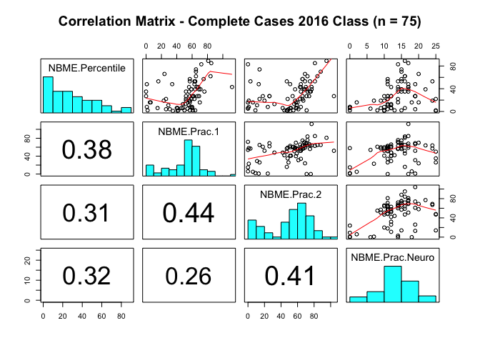

I ran a correlation matrix here with the 2016 data, including only the students who completed all 3 practice NBME exams. Out of 139 students, only 75 (54%) completed all three. There was a weak positive correlation associated with each of the scores on the untransformed outcome. Note that this only includes about half of the data.

Transform
---------

``` r
## Consider Potential Transformations
p1 <- ggplot(dems.complete, aes(x = NBME.Percentile)) +
  geom_histogram(fill = "#1385F0", col = "white") +
  labs(title = "Untransformed", x = "NBME Percentile") +
  theme_classic()

p2 <- ggplot(dems.complete, aes(x = (NBME.Percentile)^0.5)) +
  geom_histogram(fill = "hotpink", col = "white") +
  labs(title = "sqrt(Outcome)", x = "NBME Percentile") +
  theme_classic()

p3 <- ggplot(dems.complete, aes(x = (NBME.Percentile)^2)) +
  geom_histogram(fill = "#1385F0", col = "white") +
  labs(title = "(Outcome)^2", x = "NBME Percentile") +
  theme_classic()

p4 <- ggplot(dems.complete, aes(x = log(NBME.Percentile + 1))) +
  geom_histogram(fill = "#1385F0", col = "white") +
  labs(title = "log(Outcome + 1)", x = "NBME Percentile") +
  theme_classic()

grid.arrange(p2, p1, p3, p4, ncol = 2)
```

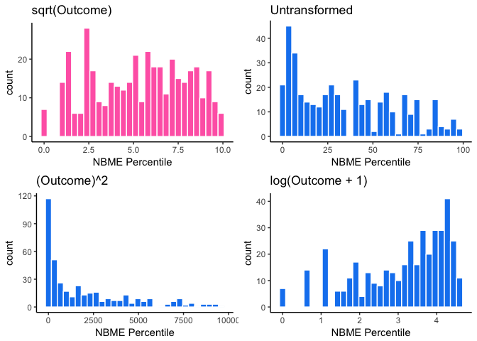

``` r
# I think the square root transformaiton looks best here
# Create a new variable with the sqrt of the outcome
```

Plots of potential transformations of the NBME Percentile are included here. We are hoping for a somewhat normal distribution (or at least symmetrical) in the outcome. So far the square root of the outcome looks the best here. Once the regression models have been created, residual plots will be considered to select the best transformation.

Running a box cox also suggests the use of a transformation to a positive power less than 1.

Analyses
========

Create a regression model to predict the percentile on the NBME Physiology exam based on the following variables:

-   `Phys.B1.E1`: Medical Physiology Exam Block 1 - Basic Principles
-   `Phys.B2.E2`: Medical Physiology Exam Block 2 - Neurophysiology
-   `Phys.B3.E3`: Medical Physiology Exam Block 3 - Cardiovascular Physiology
-   `Phys.B4.E4`: Medical Physiology Exam Block 4 - Renal Physiology
-   `Phys.B5.E5`: Medical Physiology Exam Block 5 - Respiratory Physiology
-   `Phys.B6.E6`: Medical Physiology Exam Block 6 - Gastrointestinal Physiology
-   `Phys.B7.E7`: Medical Physiology Exam Block 7 - Endocrine Physiology
-   `Phys.B8.E8`: Medical Physiology Exam Block 8 - Physiology of Everyday Life
-   `Trans.B1.E1`: Translational Physiology Exam Block 1 - Basic Principles
-   `Trans.B2.E2`: Translational Physiology Exam Block 2 - Neurophysiology
-   `Trans.B3.E3`: Translational Physiology Exam Block 3 - Cardiovascular Physiology
-   `Trans.B4.E4`: Translational Physiology Exam Block 4 - Renal Physiology
-   `Trans.B5.E5`: Translational Physiology Exam Block 5 - Respiratory Physiology
-   `Trans.B6.E6`: Translational Physiology Exam Block 6 - Gastrointestinal Physiology
-   `Trans.B7.E7`: Translational Physiology Exam Block 7 - Endocrine Physiology
-   `Trans.B8.E8`: Translational Physiology Exam Block 8 - Physiology of Everyday Life

KS
--

Include all of the predictors - all 8 Medical Physiology block exam scores and all 8 Translational Physiology block exam scores - to predict the student's NBME Percentile. Include only the students for which we have complete data.

``` r
# Use all the predictors
dd <- datadist(dems.complete)
options(datadist = "dd")

ols.ks <- ols(NBME.sqrt ~ Phys.B1.E1 + Phys.B2.E2 + Phys.B3.E3 + 
         Phys.B4.E4 + Phys.B5.E5 + Phys.B6.E6 + Phys.B7.E7 + Phys.B8.E8 + 
           Trans.B1.E1 + Trans.B2.E2 + Trans.B3.E3 + Trans.B4.E4 + 
           Trans.B5.E5 + Trans.B6.E6 + Trans.B7.E7 + Trans.B8.E8, 
         data = dems.complete,
         x = TRUE, y = TRUE)
ols.ks
```

    Linear Regression Model
     
     ols(formula = NBME.sqrt ~ Phys.B1.E1 + Phys.B2.E2 + Phys.B3.E3 + 
         Phys.B4.E4 + Phys.B5.E5 + Phys.B6.E6 + Phys.B7.E7 + Phys.B8.E8 + 
         Trans.B1.E1 + Trans.B2.E2 + Trans.B3.E3 + Trans.B4.E4 + Trans.B5.E5 + 
         Trans.B6.E6 + Trans.B7.E7 + Trans.B8.E8, data = dems.complete, 
         x = TRUE, y = TRUE)
     
                    Model Likelihood     Discrimination    
                       Ratio Test           Indexes        
     Obs     395    LR chi2    383.52    R2       0.621    
     sigma1.6558    d.f.           16    R2 adj   0.605    
     d.f.    378    Pr(> chi2) 0.0000    g        2.367    
     
     Residuals
     
          Min       1Q   Median       3Q      Max 
     -5.18064 -1.09494  0.04483  1.02415  4.88679 
     
     
                 Coef     S.E.   t      Pr(>|t|)
     Intercept   -19.7907 1.6288 -12.15 <0.0001 
     Phys.B1.E1    0.0774 0.0144   5.39 <0.0001 
     Phys.B2.E2    0.0107 0.0149   0.72 0.4730  
     Phys.B3.E3    0.0491 0.0137   3.59 0.0004  
     Phys.B4.E4   -0.0077 0.0150  -0.51 0.6070  
     Phys.B5.E5    0.0215 0.0150   1.43 0.1522  
     Phys.B6.E6    0.0309 0.0124   2.48 0.0134  
     Phys.B7.E7    0.0151 0.0140   1.07 0.2838  
     Phys.B8.E8   -0.0193 0.0149  -1.29 0.1977  
     Trans.B1.E1   0.0025 0.0096   0.26 0.7975  
     Trans.B2.E2   0.0034 0.0086   0.40 0.6917  
     Trans.B3.E3   0.0060 0.0097   0.61 0.5399  
     Trans.B4.E4   0.0170 0.0103   1.66 0.0987  
     Trans.B5.E5   0.0176 0.0116   1.51 0.1311  
     Trans.B6.E6   0.0397 0.0117   3.38 0.0008  
     Trans.B7.E7   0.0089 0.0126   0.70 0.4829  
     Trans.B8.E8   0.0222 0.0131   1.69 0.0922  
     

``` r
rms::vif(ols.ks)
```

     Phys.B1.E1  Phys.B2.E2  Phys.B3.E3  Phys.B4.E4  Phys.B5.E5  Phys.B6.E6 
       2.273922    2.468031    2.846130    1.902240    1.970418    2.311408 
     Phys.B7.E7  Phys.B8.E8 Trans.B1.E1 Trans.B2.E2 Trans.B3.E3 Trans.B4.E4 
       1.867864    1.232631    1.992782    1.514438    1.969414    1.555184 
    Trans.B5.E5 Trans.B6.E6 Trans.B7.E7 Trans.B8.E8 
       1.521618    1.863726    1.453302    1.289471 

The variance inflation factors are all below 5. Surprisingly, there is no indication of collinearity issues between predictors. The model accounts for 0.621 of variability in the predictions. In this model, Medical Physiology exams from blocks 1, 3, 6 and the Translational Physiology exam from block 6 were associated with significant results in the outcome.

``` r
# plot the anova values
plot(anova(ols.ks))
```

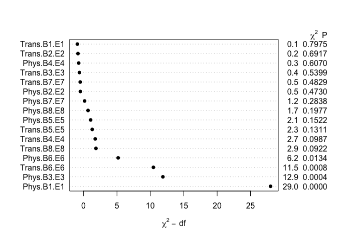

The anova plot suggests that Blocks 1 (Cell), 3 (Cardio), and 6 (GI) from Medical Physiology and Block 6 from Translational Physiology were most important in the model containing all block exam scores as predictors. Translational Physiology Exams from Block 5 (Respiratory) and 8 (Everyday Life) were also significant at the 10 percent level.

### Effects

``` r
plot(summary(ols.ks), main = "")
```

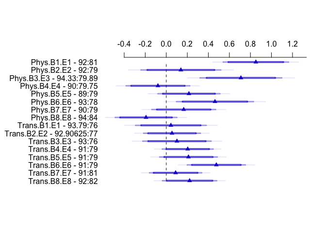

The plot above shows the effect sizes from each of the exams. Medical Physiology blocks 1 and 3 accounted for the largest effect sizes in outcome.

### Nomogram

``` r
plot(nomogram(ols.ks))
```

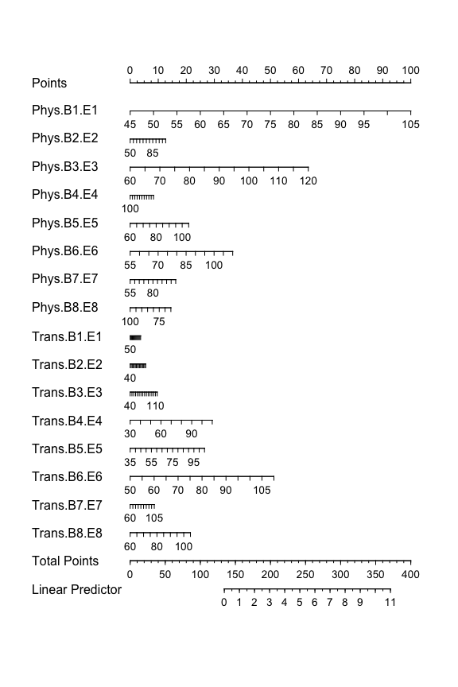

``` r
plot(calibrate(ols.ks))
```

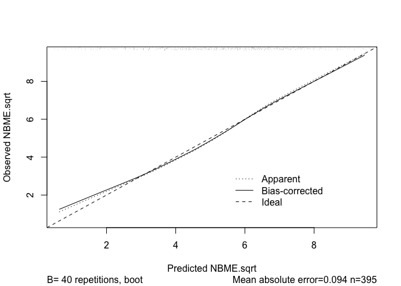


    n=395   Mean absolute error=0.094   Mean squared error=0.01961
    0.9 Quantile of absolute error=0.151

This Calibration plot is quite good. However, the model does seem to underpredict for scores below about the 15th percentile.

### Plot Predictions: Kitchen Sink

``` r
plot.ks.nbme3 <- ggplot(Predict(ols.ks, Phys.B3.E3 = 60:110)) +
  geom_point(aes(x = Phys.B3.E3, y = NBME.sqrt), data = dems.complete) +
    theme_bw() +
  labs(x = "Cardiovascular Physiology Exam Score",
         y = "Sqrt(NBME Percentile)",
         #title = "Model 1 - Kitchen Sink Predictions",
         subtitle = "Holding all other predictors at their medians")

plot.ks.nbme1 <- ggplot(Predict(ols.ks, Phys.B1.E1 = 40:105)) +
  geom_point(aes(x = Phys.B1.E1, y = NBME.sqrt), data = dems.complete) +
    theme_bw() +
  labs(x = "Cellular Physiology Exam Score",
         y = "Sqrt(NBME Percentile)",
         title = "Model 1 - Kitchen Sink Predictions",
         subtitle = "Holding all other predictors at their medians")

grid.arrange(plot.ks.nbme1, plot.ks.nbme3, nrow = 2)
```

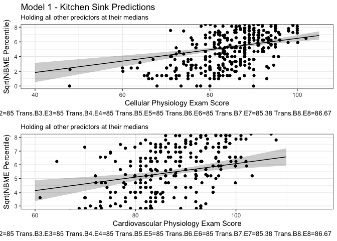

### Validate

``` r
set.seed(314); 
ols.ks.val <- validate(ols.ks)
ols.ks.val
```

              index.orig training   test optimism index.corrected  n
    R-square      0.6213   0.6277 0.6023   0.0254          0.5959 40
    MSE           2.6235   2.5562 2.7549  -0.1987          2.8222 40
    g             2.3669   2.3655 2.3318   0.0337          2.3331 40
    Intercept     0.0000   0.0000 0.1032  -0.1032          0.1032 40
    Slope         1.0000   1.0000 0.9799   0.0201          0.9799 40

``` r
ols.ks.g <- glance(ols.ks)
```

Validate the kitchen sink model using simulated data via bootstrapping. Optimism in the R-square is only a few points, suggesting that the model predicts reasonably with new data.

``` r
# Check the residual Plots
lm.ks <- lm(NBME.sqrt ~ Phys.B1.E1 + Phys.B2.E2 + Phys.B3.E3 + 
         Phys.B4.E4 + Phys.B5.E5 + Phys.B6.E6 + Phys.B7.E7 + Phys.B8.E8 + 
           Trans.B1.E1 + Trans.B2.E2 + Trans.B3.E3 + Trans.B4.E4 + 
           Trans.B5.E5 + Trans.B6.E6 + Trans.B7.E7 + Trans.B8.E8, 
         data = dems.complete)

par(mfrow=c(2,2))
plot(lm.ks, which  = c(1,2,3,5))
```

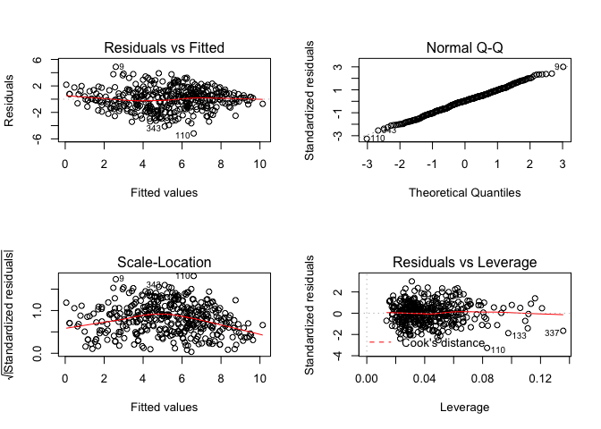

``` r
par(mfrow=c(2,2))
```

The Residuals vs Fitted in conjuction with the Scale-Location plot show no issues in the assumption of homoscedasticity (we can assume that the residuals follow the constance variance assumption). The normal Q-Q plot shows no issues with normality, however note the outliers 9, 110, and 343; however as the sample inclues 395 observations we can reasonably expect around 10 observations outside of the second quantile. The residuals vs Leverage plot shows a few highly leveraged points (points where the leverage is 3x the mean) including point 337. A future sensitivity analysis may involve removing observation 337 to see if this substantially changes the model.

Best Subsets
------------

Use the best Subsets technique to identify which predictors should be included in the model.

``` r
# Save the variables for Best Subsets
preds <- with(dems.complete, cbind(Phys.B1.E1, Phys.B2.E2, Phys.B3.E3, 
         Phys.B4.E4, Phys.B5.E5, Phys.B6.E6, Phys.B7.E7, Phys.B8.E8, 
           Trans.B1.E1, Trans.B2.E2, Trans.B3.E3, Trans.B4.E4, 
           Trans.B5.E5, Trans.B6.E6, Trans.B7.E7, Trans.B8.E8))

x1 <- regsubsets(preds, dems.complete$NBME.sqrt, nvmax=16) # 16 possible variables
rs <- summary(x1) # summary of where the variables are


temp <-  data.frame(p = 2:17, adjr2 = round(rs$adjr2, 3)) # Adj R^2
temp$bic <- round(rs$bic, 2) # BIC

# Calculate Corrected AIC
n = nrow(dems.complete) # save number of observations
rs$aic.corr <- n*log(rs$rss / n) + 2*(2:17) +
               (2 * (2:17) * ((2:17) + 1) / (n - (2:17) - 1))
temp$aic.corr <- round(rs$aic.corr, 2)

# Mallow's Cp
temp$Cp <- round(rs$cp, 1)
temp$difference <- round(rs$cp, 1) - 2:17

pander(temp)
```

<table style="width:67%;">
<colgroup>
<col width="5%" />
<col width="11%" />
<col width="9%" />
<col width="15%" />
<col width="8%" />
<col width="16%" />
</colgroup>
<thead>
<tr class="header">
<th align="center">p</th>
<th align="center">adjr2</th>
<th align="center">bic</th>
<th align="center">aic.corr</th>
<th align="center">Cp</th>
<th align="center">difference</th>
</tr>
</thead>
<tbody>
<tr class="odd">
<td align="center">2</td>
<td align="center">0.446</td>
<td align="center">-222.2</td>
<td align="center">534.4</td>
<td align="center">160.8</td>
<td align="center">158.8</td>
</tr>
<tr class="even">
<td align="center">3</td>
<td align="center">0.531</td>
<td align="center">-283.3</td>
<td align="center">469.3</td>
<td align="center">76.5</td>
<td align="center">73.5</td>
</tr>
<tr class="odd">
<td align="center">4</td>
<td align="center">0.582</td>
<td align="center">-323.9</td>
<td align="center">424.8</td>
<td align="center">26.8</td>
<td align="center">22.8</td>
</tr>
<tr class="even">
<td align="center">5</td>
<td align="center">0.597</td>
<td align="center">-333.2</td>
<td align="center">411.6</td>
<td align="center">13</td>
<td align="center">8</td>
</tr>
<tr class="odd">
<td align="center">6</td>
<td align="center">0.601</td>
<td align="center">-332.3</td>
<td align="center">408.6</td>
<td align="center">10</td>
<td align="center">4</td>
</tr>
<tr class="even">
<td align="center">7</td>
<td align="center">0.605</td>
<td align="center">-330.9</td>
<td align="center">406.1</td>
<td align="center">7.5</td>
<td align="center">0.5</td>
</tr>
<tr class="odd">
<td align="center">8</td>
<td align="center">0.607</td>
<td align="center">-328.1</td>
<td align="center">405</td>
<td align="center">6.3</td>
<td align="center">-1.7</td>
</tr>
<tr class="even">
<td align="center">9</td>
<td align="center">0.608</td>
<td align="center">-324.4</td>
<td align="center">404.7</td>
<td align="center">6.1</td>
<td align="center">-2.9</td>
</tr>
<tr class="odd">
<td align="center">10</td>
<td align="center">0.609</td>
<td align="center">-320.2</td>
<td align="center">405.1</td>
<td align="center">6.4</td>
<td align="center">-3.6</td>
</tr>
<tr class="even">
<td align="center">11</td>
<td align="center">0.609</td>
<td align="center">-315.4</td>
<td align="center">406</td>
<td align="center">7.2</td>
<td align="center">-3.8</td>
</tr>
<tr class="odd">
<td align="center">12</td>
<td align="center">0.609</td>
<td align="center">-310.3</td>
<td align="center">407.3</td>
<td align="center">8.4</td>
<td align="center">-3.6</td>
</tr>
<tr class="even">
<td align="center">13</td>
<td align="center">0.608</td>
<td align="center">-304.9</td>
<td align="center">408.9</td>
<td align="center">9.9</td>
<td align="center">-3.1</td>
</tr>
<tr class="odd">
<td align="center">14</td>
<td align="center">0.608</td>
<td align="center">-299.3</td>
<td align="center">410.6</td>
<td align="center">11.5</td>
<td align="center">-2.5</td>
</tr>
<tr class="even">
<td align="center">15</td>
<td align="center">0.607</td>
<td align="center">-293.6</td>
<td align="center">412.5</td>
<td align="center">13.2</td>
<td align="center">-1.8</td>
</tr>
<tr class="odd">
<td align="center">16</td>
<td align="center">0.606</td>
<td align="center">-287.8</td>
<td align="center">414.5</td>
<td align="center">15.1</td>
<td align="center">-0.9</td>
</tr>
<tr class="even">
<td align="center">17</td>
<td align="center">0.605</td>
<td align="center">-281.9</td>
<td align="center">416.6</td>
<td align="center">17</td>
<td align="center">0</td>
</tr>
</tbody>
</table>

Med Phys Blocks 1, 3, 5, and 6 appear to be the most important predictors. Trans Phys Block 6 was also important. The goal here is to minimize the corrected AIC, BIC, and difference between mallow's Cp and the number of predictors in the model.

``` r
# Decide that we want to only use 6 predictors
# Pick the 2 best models with 6 predictors
x2 <- regsubsets(preds, dems.complete$NBME.sqrt, 
                 nbest=2, nvmax=6) # use 6 predictors + Intercept
rs2 <- summary(x2)
rs2
```

    Subset selection object
    16 Variables  (and intercept)
                Forced in Forced out
    Phys.B1.E1      FALSE      FALSE
    Phys.B2.E2      FALSE      FALSE
    Phys.B3.E3      FALSE      FALSE
    Phys.B4.E4      FALSE      FALSE
    Phys.B5.E5      FALSE      FALSE
    Phys.B6.E6      FALSE      FALSE
    Phys.B7.E7      FALSE      FALSE
    Phys.B8.E8      FALSE      FALSE
    Trans.B1.E1     FALSE      FALSE
    Trans.B2.E2     FALSE      FALSE
    Trans.B3.E3     FALSE      FALSE
    Trans.B4.E4     FALSE      FALSE
    Trans.B5.E5     FALSE      FALSE
    Trans.B6.E6     FALSE      FALSE
    Trans.B7.E7     FALSE      FALSE
    Trans.B8.E8     FALSE      FALSE
    2 subsets of each size up to 6
    Selection Algorithm: exhaustive
             Phys.B1.E1 Phys.B2.E2 Phys.B3.E3 Phys.B4.E4 Phys.B5.E5 Phys.B6.E6
    1  ( 1 ) " "        " "        "*"        " "        " "        " "       
    1  ( 2 ) "*"        " "        " "        " "        " "        " "       
    2  ( 1 ) "*"        " "        "*"        " "        " "        " "       
    2  ( 2 ) "*"        " "        " "        " "        " "        "*"       
    3  ( 1 ) "*"        " "        "*"        " "        " "        " "       
    3  ( 2 ) "*"        " "        "*"        " "        " "        "*"       
    4  ( 1 ) "*"        " "        "*"        " "        " "        "*"       
    4  ( 2 ) "*"        " "        "*"        " "        " "        " "       
    5  ( 1 ) "*"        " "        "*"        " "        "*"        "*"       
    5  ( 2 ) "*"        " "        "*"        " "        " "        "*"       
    6  ( 1 ) "*"        " "        "*"        " "        "*"        "*"       
    6  ( 2 ) "*"        " "        "*"        " "        "*"        "*"       
             Phys.B7.E7 Phys.B8.E8 Trans.B1.E1 Trans.B2.E2 Trans.B3.E3
    1  ( 1 ) " "        " "        " "         " "         " "        
    1  ( 2 ) " "        " "        " "         " "         " "        
    2  ( 1 ) " "        " "        " "         " "         " "        
    2  ( 2 ) " "        " "        " "         " "         " "        
    3  ( 1 ) " "        " "        " "         " "         " "        
    3  ( 2 ) " "        " "        " "         " "         " "        
    4  ( 1 ) " "        " "        " "         " "         " "        
    4  ( 2 ) "*"        " "        " "         " "         " "        
    5  ( 1 ) " "        " "        " "         " "         " "        
    5  ( 2 ) " "        " "        " "         " "         " "        
    6  ( 1 ) " "        " "        " "         " "         " "        
    6  ( 2 ) " "        " "        " "         " "         " "        
             Trans.B4.E4 Trans.B5.E5 Trans.B6.E6 Trans.B7.E7 Trans.B8.E8
    1  ( 1 ) " "         " "         " "         " "         " "        
    1  ( 2 ) " "         " "         " "         " "         " "        
    2  ( 1 ) " "         " "         " "         " "         " "        
    2  ( 2 ) " "         " "         " "         " "         " "        
    3  ( 1 ) " "         " "         "*"         " "         " "        
    3  ( 2 ) " "         " "         " "         " "         " "        
    4  ( 1 ) " "         " "         "*"         " "         " "        
    4  ( 2 ) " "         " "         "*"         " "         " "        
    5  ( 1 ) " "         " "         "*"         " "         " "        
    5  ( 2 ) " "         " "         "*"         " "         "*"        
    6  ( 1 ) " "         " "         "*"         " "         "*"        
    6  ( 2 ) "*"         " "         "*"         " "         " "        

Applying the somewhat arbitraty decision that we only want to include 6 predictors + intercept in our model suggests `Phys.B1.E1`, `Phys.B3.E3`, `Phys.B5.E5`, `Phys.B6.E6`, `Trans.B6.E6` and either `Trans.B4.E4` or `Trans.B8.E8` should be included.

``` r
dd <- datadist(dems.complete)
options(datadist = "dd")

ols.mod.6 <- ols(NBME.sqrt ~ Phys.B3.E3 + Phys.B1.E1 + Phys.B5.E5 +
         Phys.B6.E6 + Trans.B4.E4 + Trans.B5.E5, data = dems.complete,
         x = T, y = T)
ols.mod.6
```

    Linear Regression Model
     
     ols(formula = NBME.sqrt ~ Phys.B3.E3 + Phys.B1.E1 + Phys.B5.E5 + 
         Phys.B6.E6 + Trans.B4.E4 + Trans.B5.E5, data = dems.complete, 
         x = T, y = T)
     
                    Model Likelihood     Discrimination    
                       Ratio Test           Indexes        
     Obs     395    LR chi2    359.35    R2       0.597    
     sigma1.6850    d.f.            6    R2 adj   0.591    
     d.f.    388    Pr(> chi2) 0.0000    g        2.327    
     
     Residuals
     
          Min       1Q   Median       3Q      Max 
     -5.91225 -1.09547  0.03353  1.02782  5.10525 
     
     
                 Coef     S.E.   t      Pr(>|t|)
     Intercept   -18.3928 1.1121 -16.54 <0.0001 
     Phys.B3.E3    0.0612 0.0126   4.86 <0.0001 
     Phys.B1.E1    0.0839 0.0128   6.55 <0.0001 
     Phys.B5.E5    0.0329 0.0144   2.28 0.0230  
     Phys.B6.E6    0.0543 0.0111   4.91 <0.0001 
     Trans.B4.E4   0.0265 0.0100   2.66 0.0081  
     Trans.B5.E5   0.0189 0.0116   1.63 0.1045  
     

This model accounts for 0.597. All of the predictors, with the exception of the Block 5 translational exam were significant to the 95% level.

### Effects

``` r
plot(summary(ols.mod.6))
```

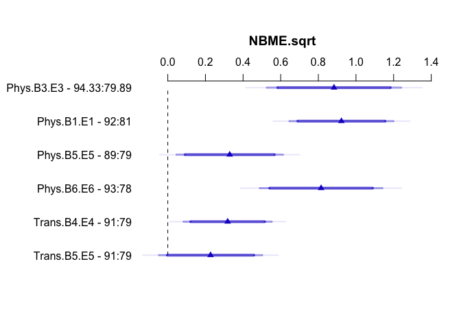

### Nomogram

``` r
plot(nomogram(ols.mod.6))
```

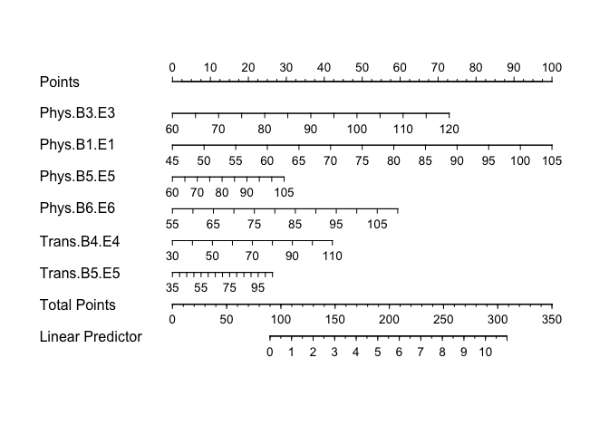

``` r
plot(calibrate(ols.mod.6))
```

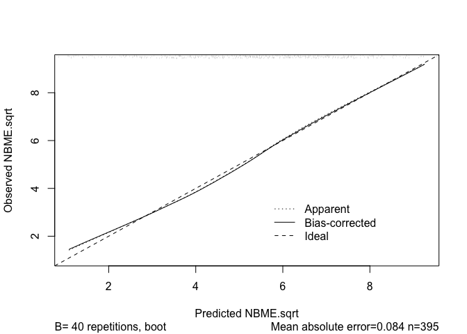


    n=395   Mean absolute error=0.084   Mean squared error=0.01223
    0.9 Quantile of absolute error=0.161

### Validate

``` r
set.seed(314); 
ols.mod.6.val <- validate(ols.mod.6)
ols.mod.6.g <- glance(ols.mod.6)
```

``` r
lm.mod.6 <- lm(NBME.sqrt ~ Phys.B3.E3 + Phys.B1.E1 + Phys.B5.E5 +
         Phys.B6.E6 + Trans.B4.E4 + Trans.B5.E5, data = dems.complete)

par(mfrow=c(2,2))
plot(lm.mod.6, which  = c(1,2,3,5))
```

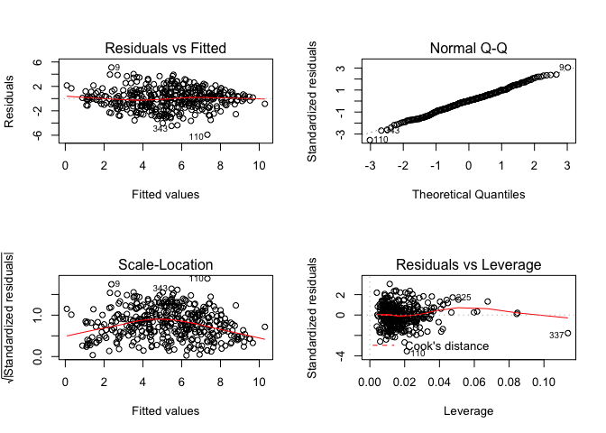

``` r
par(mfrow=c(2,2))
```

As in the kitchen sink model, there appear to be no issues with the assumption of constant variance. However there does appear to be one highly leveraged point (337).

Lasso
-----

``` r
# Save the variables for lasso
preds <- with(dems.complete, cbind(Phys.B1.E1, Phys.B2.E2, Phys.B3.E3, 
         Phys.B4.E4, Phys.B5.E5, Phys.B6.E6, Phys.B7.E7, Phys.B8.E8, 
           Trans.B1.E1, Trans.B2.E2, Trans.B3.E3, Trans.B4.E4, 
           Trans.B5.E5, Trans.B6.E6, Trans.B7.E7, Trans.B8.E8))

lasso.ks <- lars(preds, dems.complete$NBME.sqrt, type="lasso")
plot(lasso.ks)
```

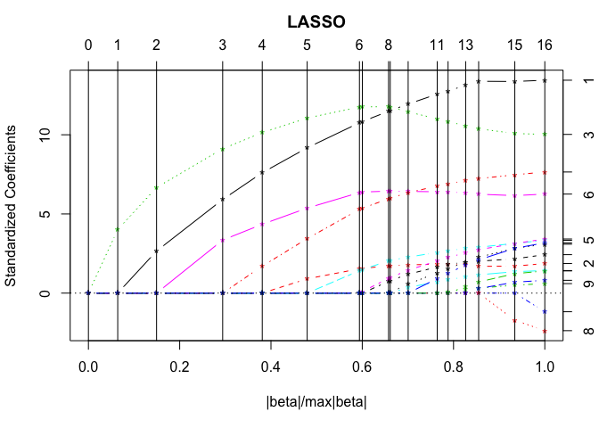

``` r
summary(lasso.ks)
```

    LARS/LASSO
    Call: lars(x = preds, y = dems.complete$NBME.sqrt, type = "lasso")
       Df    Rss      Cp
    0   1 2736.2 605.072
    1   2 2471.7 510.569
    2   3 2165.0 400.716
    3   4 1739.4 247.480
    4   5 1537.9 175.953
    5   6 1354.1 110.918
    6   7 1198.7  56.245
    7   8 1191.9  55.748
    8   9 1138.0  38.081
    9  10 1134.9  38.980
    10 11 1106.2  30.512
    11 12 1071.3  19.768
    12 13 1061.8  18.297
    13 14 1050.3  16.108
    14 15 1044.8  16.121
    15 16 1037.5  15.447
    16 17 1036.3  17.000

``` r
# 10 Fold Cross Validation
set.seed(432432)
lasso.cv <- cv.lars(preds, dems.complete$NBME.sqrt, K=10)
```

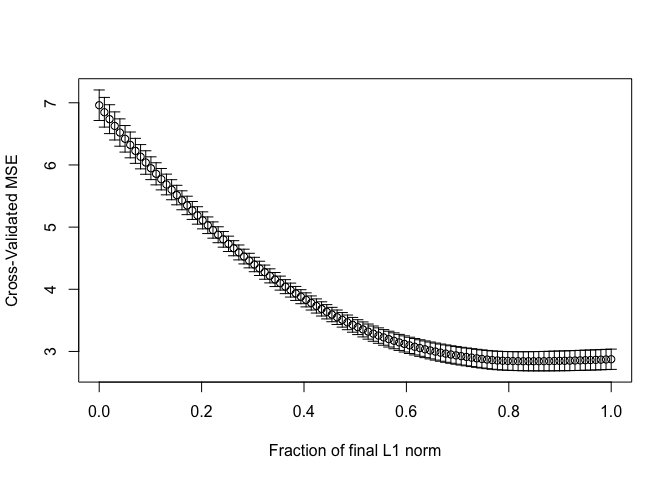

``` r
## Minimize the Cross Validated MSE
cv.frac <- lasso.cv$index[which.min(lasso.cv$cv)]
cv.frac # Minimization occurs at around 0.84
```

    [1] 0.8383838

``` r
# Get the shrunken lasso coefficients
coef.cv <- coef(lasso.ks, s=cv.frac, mode="fraction")
#round(coef.cv,4)

# Get the non-zero coefficients
round(coef.cv[coef.cv != 0], 4)
```

     Phys.B1.E1  Phys.B2.E2  Phys.B3.E3  Phys.B5.E5  Phys.B6.E6  Phys.B7.E7 
         0.0762      0.0100      0.0515      0.0184      0.0311      0.0123 
    Trans.B1.E1 Trans.B2.E2 Trans.B3.E3 Trans.B4.E4 Trans.B5.E5 Trans.B6.E6 
         0.0011      0.0005      0.0045      0.0131      0.0119      0.0371 
    Trans.B7.E7 Trans.B8.E8 
         0.0034      0.0133 

``` r
#round(lm.beta(lasso.ks.nz), 4)
```

``` r
# Make a new model containing only the non-zero coefficients
lasso.ks.nz <- lm(NBME.sqrt ~ Phys.B1.E1 + Phys.B2.E2 + Phys.B3.E3 + 
         Phys.B5.E5 + Phys.B6.E6 + Phys.B7.E7 + Trans.B1.E1 + 
           Trans.B2.E2 + Trans.B3.E3 + Trans.B4.E4 + Trans.B5.E5 + 
           Trans.B6.E6 + Trans.B7.E7 + Trans.B8.E8,
          data = dems.complete)

## lm.beta is part of the QuantPsyc library
## Non-zero lasso Coefficients
lasso.ks.ns <- round(lm.beta(lasso.ks.nz),4)

## Obtain Confidence intervals
lasso.coef.tidy <- tidy(lasso.ks.nz, conf.int = T)[, c("term", "estimate", "p.value", "conf.low", "conf.high")]
pander(lasso.coef.tidy)
```

<table style="width:76%;">
<colgroup>
<col width="16%" />
<col width="15%" />
<col width="13%" />
<col width="15%" />
<col width="15%" />
</colgroup>
<thead>
<tr class="header">
<th align="center">term</th>
<th align="center">estimate</th>
<th align="center">p.value</th>
<th align="center">conf.low</th>
<th align="center">conf.high</th>
</tr>
</thead>
<tbody>
<tr class="odd">
<td align="center">(Intercept)</td>
<td align="center">-20.9</td>
<td align="center">1.204e-39</td>
<td align="center">-23.67</td>
<td align="center">-18.13</td>
</tr>
<tr class="even">
<td align="center">Phys.B1.E1</td>
<td align="center">0.07952</td>
<td align="center">4.055e-08</td>
<td align="center">0.05161</td>
<td align="center">0.1074</td>
</tr>
<tr class="odd">
<td align="center">Phys.B2.E2</td>
<td align="center">0.008608</td>
<td align="center">0.5594</td>
<td align="center">-0.02036</td>
<td align="center">0.03757</td>
</tr>
<tr class="even">
<td align="center">Phys.B3.E3</td>
<td align="center">0.0493</td>
<td align="center">0.0003558</td>
<td align="center">0.0224</td>
<td align="center">0.0762</td>
</tr>
<tr class="odd">
<td align="center">Phys.B5.E5</td>
<td align="center">0.01959</td>
<td align="center">0.1894</td>
<td align="center">-0.009712</td>
<td align="center">0.0489</td>
</tr>
<tr class="even">
<td align="center">Phys.B6.E6</td>
<td align="center">0.03011</td>
<td align="center">0.01527</td>
<td align="center">0.005815</td>
<td align="center">0.05441</td>
</tr>
<tr class="odd">
<td align="center">Phys.B7.E7</td>
<td align="center">0.01316</td>
<td align="center">0.3408</td>
<td align="center">-0.01397</td>
<td align="center">0.04028</td>
</tr>
<tr class="even">
<td align="center">Trans.B1.E1</td>
<td align="center">0.001848</td>
<td align="center">0.8476</td>
<td align="center">-0.01704</td>
<td align="center">0.02074</td>
</tr>
<tr class="odd">
<td align="center">Trans.B2.E2</td>
<td align="center">0.003265</td>
<td align="center">0.7056</td>
<td align="center">-0.01372</td>
<td align="center">0.02024</td>
</tr>
<tr class="even">
<td align="center">Trans.B3.E3</td>
<td align="center">0.00576</td>
<td align="center">0.5542</td>
<td align="center">-0.01337</td>
<td align="center">0.02489</td>
</tr>
<tr class="odd">
<td align="center">Trans.B4.E4</td>
<td align="center">0.01533</td>
<td align="center">0.1307</td>
<td align="center">-0.004569</td>
<td align="center">0.03522</td>
</tr>
<tr class="even">
<td align="center">Trans.B5.E5</td>
<td align="center">0.01583</td>
<td align="center">0.171</td>
<td align="center">-0.006864</td>
<td align="center">0.03852</td>
</tr>
<tr class="odd">
<td align="center">Trans.B6.E6</td>
<td align="center">0.03865</td>
<td align="center">0.001013</td>
<td align="center">0.01571</td>
<td align="center">0.06159</td>
</tr>
<tr class="even">
<td align="center">Trans.B7.E7</td>
<td align="center">0.007671</td>
<td align="center">0.5427</td>
<td align="center">-0.01708</td>
<td align="center">0.03243</td>
</tr>
<tr class="odd">
<td align="center">Trans.B8.E8</td>
<td align="center">0.01852</td>
<td align="center">0.1504</td>
<td align="center">-0.006748</td>
<td align="center">0.04378</td>
</tr>
</tbody>
</table>

### Calibrate

``` r
lasso.ks.ols <- ols(NBME.sqrt ~ Phys.B1.E1 + Phys.B2.E2 + Phys.B3.E3 + 
         Phys.B5.E5 + Phys.B6.E6 + Phys.B7.E7 + Trans.B1.E1 + 
           Trans.B2.E2 + Trans.B3.E3 + Trans.B4.E4 + Trans.B5.E5 + 
           Trans.B6.E6 + Trans.B7.E7 + Trans.B8.E8,
          data = dems.complete, x=T, y=T)

plot(calibrate(lasso.ks.ols))
```

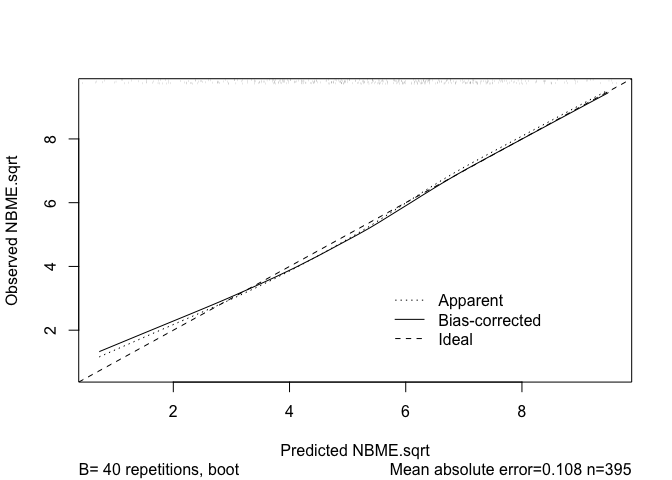


    n=395   Mean absolute error=0.108   Mean squared error=0.02396
    0.9 Quantile of absolute error=0.176

### Validate

``` r
set.seed(314)
lasso.ks.ols.val <- validate(lasso.ks.ols)
lasso.ks.ols.val
```

              index.orig training   test optimism index.corrected  n
    R-square      0.6194   0.6237 0.6028   0.0209          0.5985 40
    MSE           2.6362   2.5830 2.7513  -0.1683          2.8045 40
    g             2.3636   2.3580 2.3332   0.0248          2.3389 40
    Intercept     0.0000   0.0000 0.0802  -0.0802          0.0802 40
    Slope         1.0000   1.0000 0.9836   0.0164          0.9836 40

``` r
lasso.ks.ols.g <- glance(lasso.ks.ols)
```

Using the Lasso technique doesn't really do anything for us here; this model is similar enough to the kitchen sink.

Interaction
-----------

``` r
dd <- datadist(dems.complete)
options(datadist = "dd")

ols.mod.int <- ols(NBME.sqrt ~ Phys.B3.E3*Phys.B1.E1 + Phys.B5.E5 +
         Phys.B6.E6 + Trans.B4.E4 + Trans.B5.E5, data = dems.complete,
         x = TRUE, y = TRUE)
ols.mod.int
```

    Linear Regression Model
     
     ols(formula = NBME.sqrt ~ Phys.B3.E3 * Phys.B1.E1 + Phys.B5.E5 + 
         Phys.B6.E6 + Trans.B4.E4 + Trans.B5.E5, data = dems.complete, 
         x = TRUE, y = TRUE)
     
                    Model Likelihood     Discrimination    
                       Ratio Test           Indexes        
     Obs     395    LR chi2    363.21    R2       0.601    
     sigma1.6790    d.f.            7    R2 adj   0.594    
     d.f.    387    Pr(> chi2) 0.0000    g        2.339    
     
     Residuals
     
          Min       1Q   Median       3Q      Max 
     -5.70069 -1.16221 -0.01557  1.03646  5.04042 
     
     
                             Coef    S.E.   t     Pr(>|t|)
     Intercept               -5.8280 6.5371 -0.89 0.3732  
     Phys.B3.E3              -0.0875 0.0773 -1.13 0.2580  
     Phys.B1.E1              -0.0617 0.0757 -0.82 0.4155  
     Phys.B5.E5               0.0317 0.0144  2.20 0.0282  
     Phys.B6.E6               0.0539 0.0110  4.88 <0.0001 
     Trans.B4.E4              0.0267 0.0099  2.69 0.0074  
     Trans.B5.E5              0.0185 0.0116  1.59 0.1123  
     Phys.B3.E3 * Phys.B1.E1  0.0017 0.0009  1.95 0.0519  
     

``` r
plot(calibrate(ols.mod.int))
```


    n=395   Mean absolute error=0.057   Mean squared error=0.00573
    0.9 Quantile of absolute error=0.084

### Validate

``` r
set.seed(314); 
ols.mod.int.val <- validate(ols.mod.int)
ols.mod.int.val
```

              index.orig training   test optimism index.corrected  n
    R-square      0.6013   0.5975 0.5929   0.0045          0.5968 40
    MSE           2.7619   2.7636 2.8197  -0.0561          2.8180 40
    g             2.3387   2.3187 2.3242  -0.0055          2.3441 40
    Intercept     0.0000   0.0000 0.0133  -0.0133          0.0133 40
    Slope         1.0000   1.0000 0.9956   0.0044          0.9956 40

``` r
ols.mod.int.g <- glance(ols.mod.int)
```

Model Comparison
================

Compare the the Kitchen Sink (ols.ks), Lasso (lasso.ks), Best Subsets with 6 predictors (ols.mod.6), and a model with an interaction term (ols.mod.int).

``` r
compare.table <- data_frame(
  Model = c("Kitchen Sink", "Lasso", "Best Subsets", "Interaction"),
  Predictors = c("16", "14", "6", "6"),
  R2 = round(c(ols.ks$stats["R2"], lasso.ks.ols$stats["R2"], 
          ols.mod.6$stats["R2"], ols.mod.int$stats["R2"]),3),
  'corr R2' = round(c(ols.ks.val["R-square","index.corrected"],
                lasso.ks.ols.val["R-square","index.corrected"],
                ols.mod.6.val["R-square","index.corrected"],
                ols.mod.int.val["R-square","index.corrected"]),3),
  MSE = round(c(ols.ks.val["MSE","index.corrected"],
                lasso.ks.ols.val["MSE","index.corrected"],
                ols.mod.6.val["MSE","index.corrected"],
                ols.mod.int.val["MSE","index.corrected"]),3),
  AIC = c(round(ols.ks.g["AIC"]), round(lasso.ks.ols.g["AIC"]), 
          round(ols.mod.6.g["AIC"]), round(ols.mod.int.g["AIC"])),
  BIC = c(round(ols.ks.g["BIC"]), round(lasso.ks.ols.g["BIC"]), 
          round(ols.mod.6.g["BIC"]), round(ols.mod.int.g["BIC"])),
  g = round(c(ols.ks.val["g","index.corrected"],
                lasso.ks.ols.val["g","index.corrected"],
                ols.mod.6.val["g","index.corrected"],
                ols.mod.int.val["g","index.corrected"]),3)
)

#pander(compare.table, 
       #caption = "NBME Model Comparisons")
compare.table
```

    # A tibble: 4 x 8
             Model Predictors    R2 `corr R2`   MSE       AIC       BIC     g
             <chr>      <chr> <dbl>     <dbl> <dbl>    <list>    <list> <dbl>
    1 Kitchen Sink         16 0.621     0.596 2.822 <dbl [1]> <dbl [1]> 2.333
    2        Lasso         14 0.619     0.599 2.805 <dbl [1]> <dbl [1]> 2.339
    3 Best Subsets          6 0.597     0.595 2.834 <dbl [1]> <dbl [1]> 2.337
    4  Interaction          6 0.601     0.597 2.818 <dbl [1]> <dbl [1]> 2.344

**Kitchen Sink**: sqrt(NBME) = Phys.B1.E1 + Phys.B2.E2 + Phys.B3.E3 + Phys.B4.E4 + Phys.B5.E5 + Phys.B6.E6 + Phys.B7.E7 + Phys.B8.E8 + Trans.B1.E1 + Trans.B2.E2 + Trans.B3.E3 + Trans.B4.E4 + Trans.B5.E5 + Trans.B6.E6 + Trans.B7.E7 + Trans.B8.E8

**Lasso**: sqrt(NBME) = Phys.B1.E1 + Phys.B2.E2 + Phys.B3.E3 + Phys.B5.E5 + Phys.B6.E6 + Phys.B7.E7 + Trans.B1.E1 + Trans.B2.E2 + Trans.B3.E3 + Trans.B4.E4 + Trans.B5.E5 + Trans.B6.E6 + Trans.B7.E7 + Trans.B8.E8

**Best Subsets**: sqrt(NBME) =Phys.B3.E3 + Phys.B1.E1 + Phys.B5.E5 + Phys.B6.E6 + Trans.B4.E4 + Trans.B5.E5

**Interaction**: sqrt(NBME) = Phys.B3.E3 \* Phys.B1.E1 + Phys.B5.E5 + Phys.B6.E6 + Trans.B4.E4 + Trans.B5.E5

The Lasso model had both the best corrected R2 (what would be expected if predicting in new data), the lowest mean square error, and AIC. However, the differences were quite small. Because the difference in BIC values was greater than 20 points, I prefer the interaction model.

Conclusions
===========

-   Both Medical Physiology and Translational Physiology block exam scores carry some predictive power in determining the student's percentile on the National Board.
-   Via the model using best subsets, Medical Physiology Blocks 1, 3, 5 and 6 and Translational Physiology Blocks 4 and 5 seem to be most important in predicting the score

*Opportunities for further investigation*:

-   Observation 337 was highly leveraged; removing this point from the dataset may very well change which block exams are included in the model. However, this is unlikely to drastically increase the *R*<sup>2</sup> value. The predictive power of the model is unlikely to change, however we may find that other block exam scores were more important.
-   I would have liked to have included more demographic variables in the model, such as sex, age, race, etc.
-   I would have liked to have block exam scores for the 2014 cohort.
-   It would be great if we had data on the Kaplan Q-Bank completion. I would have liked to incorporate that as well.

*I learned*:

-   Block 8 holds very little importance in terms of the NBME score
-   Even though block exam scores, undergraduate GPA, and MCAT scores seem to be quite steady with each new class, the NBME percentiles have been trending down.

``` r
# Obtain R version/Platform/OS
sessionInfo()
```

    R version 3.4.0 (2017-04-21)
    Platform: x86_64-apple-darwin15.6.0 (64-bit)
    Running under: macOS Sierra 10.12.4

    Matrix products: default
    BLAS: /Library/Frameworks/R.framework/Versions/3.4/Resources/lib/libRblas.0.dylib
    LAPACK: /Library/Frameworks/R.framework/Versions/3.4/Resources/lib/libRlapack.dylib

    locale:
    [1] en_US.UTF-8/en_US.UTF-8/en_US.UTF-8/C/en_US.UTF-8/en_US.UTF-8

    attached base packages:
    [1] grid      stats     graphics  grDevices utils     datasets  methods  
    [8] base     

    other attached packages:
     [1] bindrcpp_0.1       dplyr_0.7.0        purrr_0.2.2.2     
     [4] readr_1.1.1        tidyr_0.6.3        tibble_1.3.3      
     [7] tidyverse_1.1.1    lars_1.2           searchable_0.3.3.1
    [10] broom_0.4.2        VIM_4.7.0          data.table_1.10.4 
    [13] colorspace_1.3-2   modelr_0.1.0       QuantPsyc_1.5     
    [16] boot_1.3-19        mctest_1.1         mitools_2.3       
    [19] forcats_0.2.0      rms_5.1-1          SparseM_1.77      
    [22] Hmisc_4.0-3        ggplot2_2.2.1      Formula_1.2-1     
    [25] survival_2.41-3    lattice_0.20-35    miceadds_2.4-12   
    [28] mice_2.30          readxl_1.0.0       ROCR_1.0-7        
    [31] gplots_3.0.1       pander_0.6.0       car_2.1-4         
    [34] gridExtra_2.2.1    tableone_0.7.3     leaps_3.0         
    [37] arm_1.9-3          lme4_1.1-13        Matrix_1.2-10     
    [40] MASS_7.3-47        rmdformats_0.3.3   knitr_1.16        

    loaded via a namespace (and not attached):
      [1] backports_1.1.0       blme_1.0-4            sm_2.2-5.4           
      [4] plyr_1.8.4            igraph_1.0.1          grouped_0.6-0        
      [7] GPArotation_2014.11-1 lazyeval_0.2.0        sp_1.2-4             
     [10] splines_3.4.0         polycor_0.7-9         TH.data_1.0-8        
     [13] digest_0.6.12         htmltools_0.3.6       gdata_2.18.0         
     [16] magrittr_1.5          checkmate_1.8.2       sirt_2.0-25          
     [19] cluster_2.0.6         sfsmisc_1.1-1         sandwich_2.3-4       
     [22] lpSolve_5.6.13        rvest_0.3.2           haven_1.0.0          
     [25] jsonlite_1.5          bindr_0.1             zoo_1.8-0            
     [28] ape_4.1               glue_1.1.0            multiwayvcov_1.2.3   
     [31] gtable_0.2.0          MatrixModels_0.4-1    sjmisc_2.5.0         
     [34] questionr_0.6.0       mirt_1.24             kernlab_0.9-25       
     [37] DEoptimR_1.0-8        abind_1.4-5           scales_0.4.1         
     [40] mvtnorm_1.0-6         miniUI_0.1.1          Rcpp_0.12.11         
     [43] laeken_0.4.6          xtable_1.8-2          htmlTable_1.9        
     [46] foreign_0.8-68        stats4_3.4.0          survey_3.32          
     [49] vcd_1.4-3             httr_1.2.1            htmlwidgets_0.8      
     [52] RColorBrewer_1.1-2    lavaan_0.5-23.1097    acepack_1.4.1        
     [55] pkgconfig_2.0.1       nnet_7.3-12           labeling_0.3         
     [58] rlang_0.1.1           reshape2_1.4.2        munsell_0.4.3        
     [61] cellranger_1.1.0      tools_3.4.0           sjlabelled_1.0.0     
     [64] evaluate_0.10         stringr_1.2.0         yaml_2.1.14          
     [67] robustbase_0.92-7     ic.infer_1.1-5        caTools_1.17.1       
     [70] nlme_3.1-131          mime_0.5              quantreg_5.33        
     [73] lavaan.survey_1.1.3.1 xml2_1.1.1            compiler_3.4.0       
     [76] pbkrtest_0.4-7        rstudioapi_0.6        e1071_1.6-8          
     [79] kappalab_0.4-7        pbivnorm_0.6.0        stringi_1.1.5        
     [82] highr_0.6             cubature_1.3-8        TAM_2.1-43           
     [85] psych_1.7.5           nloptr_1.0.4          tensorA_0.36         
     [88] stringdist_0.9.4.4    CDM_5.5-21            lmtest_0.9-35        
     [91] combinat_0.0-8        bitops_1.0-6          corpcor_1.6.9        
     [94] httpuv_1.3.3          MCMCglmm_2.24         R6_2.2.1             
     [97] latticeExtra_0.6-28   bookdown_0.4          KernSmooth_2.23-15   
    [100] codetools_0.2-15      polspline_1.1.12      gtools_3.5.0         
    [103] assertthat_0.2.0      rprojroot_1.2         mnormt_1.5-5         
    [106] multcomp_1.4-6        hms_0.3               WrightMap_1.2.1      
    [109] mgcv_1.8-17           parallel_3.4.0        quadprog_1.5-5       
    [112] rpart_4.1-11          class_7.3-14          coda_0.19-1          
    [115] minqa_1.2.4           rmarkdown_1.6         lubridate_1.6.0      
    [118] shiny_1.0.3           base64enc_0.1-3
